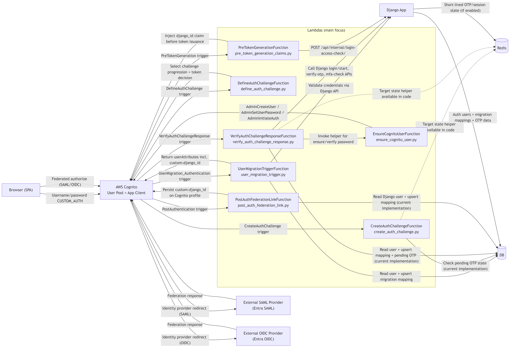

# Infrastructure Diagram: Login and Migration

This document explains the infrastructure diagram for authentication and migration flows, with a Lambda-centric view.

Diagram file:
- Source: `docs/diagrams/infra-login-migration.mmd`
- Rendered: `docs/diagrams/infra-login-migration.png`

---

## Diagram

---

## Components in Scope

The diagram includes the requested components and the runtime paths between them:

1. **Cognito** — `User Pool + App Client` for CUSTOM_AUTH and federated OAuth/OIDC code flows.
2. **External providers** — SAML provider (Entra SAML) and OIDC provider (Entra OIDC).
3. **Django app** — business/auth policy system and internal API endpoints.
4. **DB** — persistent storage for users, mappings, and challenge data.
5. **Redis** — short-lived state storage (included as architecture target and helper support in code).
6. **All Lambdas** — all Cognito-triggered and helper Lambdas in `infrastructure/src/`.

---

## Lambda Inventory (Main Focus)

All Lambda functions used by login/migration flows:

| Lambda (SAM resource) | Code file | Trigger / caller | Role in flow |
|---|---|---|---|
| `UserMigrationTriggerFunction` | `infrastructure/src/user_migration_trigger.py` | Cognito `UserMigration_Authentication` | Migrates user on first legacy-auth login; validates Django credentials; returns Cognito user attributes including `custom:django_id`. |
| `DefineAuthChallengeFunction` | `infrastructure/src/define_auth_challenge.py` | Cognito CUSTOM_AUTH trigger | Decides whether to continue challenges, fail auth, or issue tokens. |
| `CreateAuthChallengeFunction` | `infrastructure/src/create_auth_challenge.py` | Cognito CUSTOM_AUTH trigger | Chooses next challenge step (`PASSWORD_VERIFY` vs `OTP_VERIFY`) based on pending OTP state. |
| `VerifyAuthChallengeResponseFunction` | `infrastructure/src/verify_auth_challenge_response.py` | Cognito CUSTOM_AUTH trigger | Core login engine: validates password/OTP, calls Django APIs, performs migration path, and controls challenge completion. |
| `EnsureCognitoUserFunction` | `infrastructure/src/ensure_cognito_user.py` | Invoked by `VerifyAuthChallengeResponseFunction` | Non-VPC helper for Cognito Admin APIs (`ensure` user and `verify_password` for migrated users). |
| `PostAuthFederationLinkFunction` | `infrastructure/src/post_auth_federation_link.py` | Cognito `PostAuthentication` | For federated logins, links Cognito identity to Django user mapping and persists `custom:django_id`. |
| `PreTokenGenerationFunction` | `infrastructure/src/pre_token_generation_claims.py` | Cognito `PreTokenGeneration` | Unified access gate via Django `/api/internal/login-access-check/`; injects `django_id` claim before token issuance. |

---

## Login and Migration Flows in the Diagram

### 1) Username/password CUSTOM_AUTH path

Primary code path:
- `define_auth_challenge.py`
- `create_auth_challenge.py`
- `verify_auth_challenge_response.py`
- `ensure_cognito_user.py`

High-level sequence:
1. Browser starts Cognito CUSTOM_AUTH.
2. Cognito invokes `DefineAuthChallenge` and `CreateAuthChallenge`.
3. `CreateAuthChallenge` determines whether current step is password or OTP.
4. Cognito invokes `VerifyAuthChallengeResponse`:
   - For **migrated** users: verifies password against Cognito via `EnsureCognitoUser(action=verify_password)` then calls Django `mfa-check`.
   - For **non-migrated** users: validates via Django login-start, then calls `EnsureCognitoUser(action=ensure)` and upserts mapping.
   - If OTP required: verifies OTP through Django verify endpoint.
5. `DefineAuthChallenge` decides token issuance when challenge result is successful.
6. Before token issuance, Cognito invokes `PreTokenGeneration` for access gate + `django_id` claim injection.

### 2) Federated SAML/OIDC path

Primary code path:
- `post_auth_federation_link.py`
- `pre_token_generation_claims.py`

High-level sequence:
1. Browser starts Cognito federated auth (`identity_provider=EntraSaml` or `EntraOidc`).
2. Cognito redirects to external provider and receives provider response.
3. On successful federated auth, Cognito invokes `PostAuthentication` (`PostAuthFederationLink`):
   - resolves Django user by email,
   - upserts mapping,
   - persists `custom:django_id` in Cognito.
4. Cognito invokes `PreTokenGeneration`:
   - derives login method (`password` / `saml` / `oidc`),
   - calls Django `/api/internal/login-access-check/`,
   - receives `allowed` + `django_id`,
   - injects `django_id` claim into token.

### 3) User migration trigger path

Primary code path:
- `user_migration_trigger.py`

This path is tied to Cognito `UserMigration_Authentication` and can migrate users by validating against Django and creating the canonical Cognito profile attributes (`email`, `custom:django_id`).

---

## Data and State Placement

### DB (persistent)

Used for long-lived data and mapping operations in current implementation:
- user lookup
- migration mapping upsert
- pending OTP records (current CUSTOM_AUTH implementation in `create_auth_challenge.py` and `verify_auth_challenge_response.py`)

### Redis (short-lived)

Included in architecture and codebase for short-lived login state:
- helper module exists: `infrastructure/src/redis_otp_state.py`
- intended use: TTL-based pending OTP/session state

Current code reality:
- CUSTOM_AUTH triggers still persist pending OTP in DB.
- Redis helper exists and is represented in the diagram as the target short-lived state mechanism.

---

## Django Integration Surface Used by Lambdas

Endpoints used in login/migration paths:
- `POST /api/auth/login/start/` (password validation + MFA requirement)
- `POST /api/auth/login/verify-otp/` (OTP verification)
- `POST /api/auth/mfa-check/` (migrated-user MFA check)
- `POST /api/internal/login-access-check/` (PreToken access gate + `django_id`)

These endpoints are called from:
- `verify_auth_challenge_response.py`
- `pre_token_generation_claims.py`

---

## Notes

- The diagram intentionally focuses on **Lambda responsibilities** and flow wiring, as requested.
- It includes both the **current implemented links** and the **Redis short-lived state target** reflected by the existing helper module.
