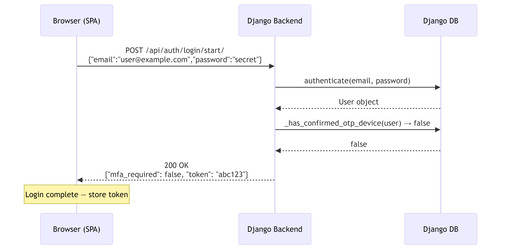
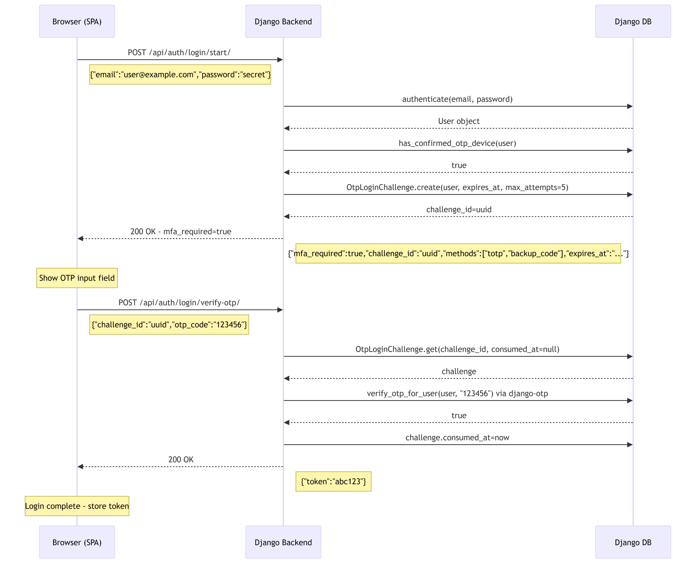
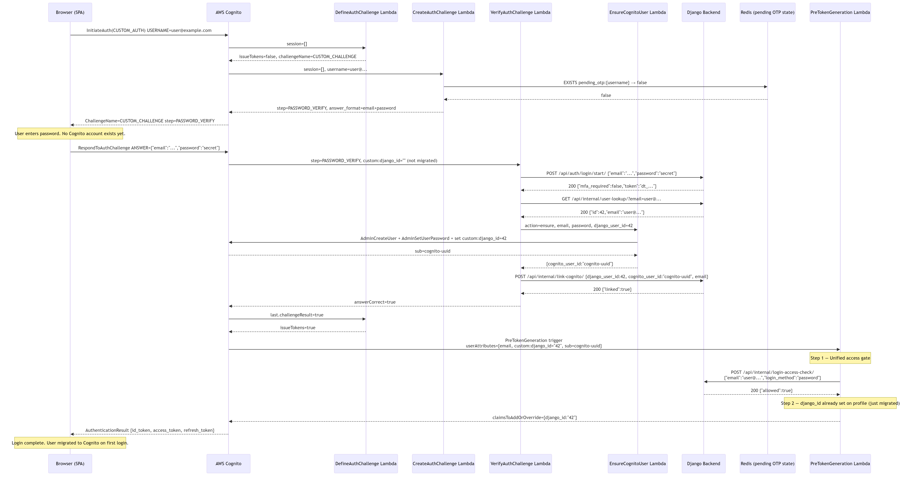
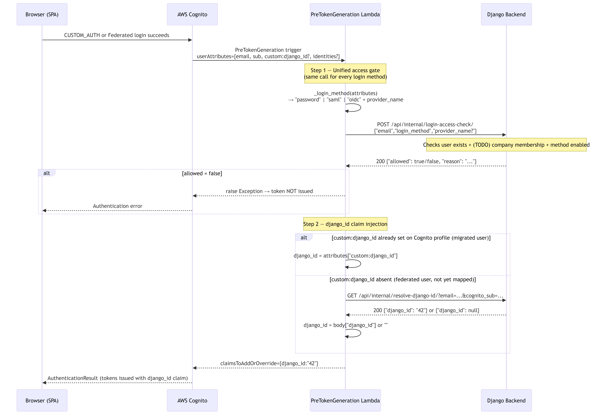

# Login / Password + OTP Authentication Flow

This document covers the Login/Password + OTP authentication flow across three evolutionary phases:

1. **Pure Django** — authentication is handled entirely by the Django backend.
2. **Migration** — Cognito Custom Auth is used; on the user's first login, they are transparently migrated from Django to Cognito.
3. **Post-Migration** — user credentials are validated natively against Cognito; Django is only queried for MFA status.

It also describes the Login/Password method access gate that should be implemented in the `PreTokenGeneration` trigger.

---

## Table of Contents

- [Entities](#entities)
- [Architecture Decision: Django as Single DB Gateway](#architecture-decision-django-as-single-db-gateway)
- [1. Pure Django Approach](#1-pure-django-approach)
- [2. Migration Process](#2-migration-process)
  - [2.0 — How Cognito Knows a User is Migrated](#20--how-cognito-knows-a-user-is-migrated)
- [3. Post-Migration (Cognito-Native Password Check)](#3-post-migration-cognito-native-password-check)
- [4. Comparison and Login-Method Access Gate](#4-comparison-and-login-method-access-gate)

---

## Entities

| Entity | Role |
|---|---|
| **Browser (SPA)** | Frontend single-page application (`web-login/app.js`). Initiates all auth flows; exchanges tokens via Cognito or Django REST endpoints. |
| **Django Backend** | DRF REST API running on EC2 (`monolith/accounts/views.py`). **Single source of truth** for all user data, OTP devices, migration mappings, and MFA challenge state. All data access from Lambdas goes through Django REST endpoints — Lambdas never query the database directly. |
| **Django DB** | MySQL database backing the Django monolith. Holds `auth_user`, `otp_*` device tables, `otp_login_challenge`, `user_migration_mapping`, `saml_auth_session`. No longer accessed directly by Lambda functions. |
| **Redis** | Short-lived key/value store for pending OTP state, replacing the former `cognito_custom_auth_pending` MySQL table. Keys are namespaced as `pending_otp:{cognito_username}` and expire automatically via a configurable TTL (default 5 minutes, set by `REDIS_OTP_TTL_SECONDS`). |
| **AWS Cognito** | Managed identity provider. Hosts the user pool, orchestrates CUSTOM_AUTH, and issues JWT tokens. |
| **DefineAuthChallenge Lambda** | `infrastructure/src/define_auth_challenge.py`. Tells Cognito whether to issue tokens, fail auth, or request the next challenge. No external calls. |
| **CreateAuthChallenge Lambda** | `infrastructure/src/create_auth_challenge.py`. Determines which challenge step is next (`PASSWORD_VERIFY` or `OTP_VERIFY`) by checking Redis for a pending OTP key. |
| **VerifyAuthChallenge Lambda** | `infrastructure/src/verify_auth_challenge_response.py`. Core logic: validates credentials, triggers migration (non-migrated path) or Cognito-native check (migrated path), persists pending OTP state to Redis, calls Django internal API for user lookup and mapping. |
| **EnsureCognitoUser Lambda** | `infrastructure/src/ensure_cognito_user.py`. Non-VPC helper Lambda. Handles Cognito Admin API calls (`AdminCreateUser`, `AdminSetUserPassword`, `AdminInitiateAuth`). Avoids VPC → Cognito PrivateLink constraints. |
| **PreTokenGeneration Lambda** | `infrastructure/src/pre_token_generation_claims.py`. Runs before every token issuance for **all login methods** (password, SAML, OIDC). Calls Django `POST /api/internal/login-access-check/` to gate access uniformly, then injects the `django_id` custom claim. No direct DB access. |

---

## Architecture Decision: Django as Single DB Gateway

Lambda functions **never connect to MySQL directly**. All data access goes through Django REST endpoints. This was a deliberate architectural decision with the following benefits:

| Concern | Old approach (direct MySQL) | New approach (via Django) |
|---|---|---|
| **Security** | Lambda needs DB credentials; credentials must be kept in SSM | Only Django holds DB credentials; Lambdas need no DB access |
| **Separation of concerns** | Business logic split between Lambda and raw SQL | Business logic lives entirely in Django |
| **Schema changes** | Require Lambda redeployment if column names change | Django ORM absorbs schema changes transparently |
| **Validation** | None — Lambdas can write invalid data | Django serializers and model validation enforce correctness |
| **Testability** | Lambdas hard to unit test with real DB | Django views are standard DRF endpoints, easy to test |
| **VPC complexity** | All DB-accessing Lambdas must be in VPC | Only Django EC2 instance needs DB VPC access |

### Internal API Endpoints Summary

These endpoints are **not browser-facing** — they are called only by Lambda functions. They require no user authentication (called server-to-server within the private network).

| Endpoint | Method | Called by | Purpose |
|---|---|---|---|
| `/api/internal/user-lookup/` | `GET` | `VerifyAuthChallenge` | Fetch `{id, email}` by email |
| `/api/internal/link-cognito/` | `POST` | `VerifyAuthChallenge` | Upsert `user_migration_mapping` |
| `/api/internal/resolve-django-id/` | `GET` | `PreTokenGeneration` | Resolve `django_id` by email or `cognito_sub` |
| `/api/internal/login-access-check/` | `POST` | `PreTokenGeneration` | **Unified access gate** — check user is allowed to log in with the given method (`password` / `saml` / `oidc`). Called for every login regardless of method. |
| `/api/internal/federated-access-check/` | `POST` | ~~`PreTokenGeneration`~~ | *Superseded by `/api/internal/login-access-check/`* |
| `/api/internal/password-login-access-check/` | `POST` | ~~`PreTokenGeneration`~~ | *Superseded by `/api/internal/login-access-check/`* |

### Pending OTP State: Redis

The cross-Lambda pending OTP state (formerly `cognito_custom_auth_pending` MySQL table) is stored in **Redis** using a native TTL:

- **Key**: `pending_otp:{cognito_username}`
- **Value**: `{"email": "...", "django_challenge_id": "..."}`
- **TTL**: controlled by `REDIS_OTP_TTL_SECONDS` env var (default 300 s)
- **No cleanup job needed** — Redis evicts expired keys automatically

---


In this phase, there is **no Cognito involvement**. The browser communicates directly with the Django REST API.

### 1.1 — Login Without OTP



**Flow summary:**

1. User submits email + password to `POST /api/auth/login/start/`.
2. Django authenticates the credentials using its own password hash (`django.contrib.auth.authenticate`).
3. If the user has no confirmed OTP device, Django immediately returns a DRF Token.

---

### 1.2 — Login With OTP



**Flow summary:**

1. User submits email + password to `POST /api/auth/login/start/`.
2. Django authenticates credentials.
3. Since the user has a confirmed TOTP device (`django-otp`), Django creates an `OtpLoginChallenge` record and returns a challenge payload — **no token yet**.
4. The browser shows the OTP input field.
5. User submits `challenge_id` + `otp_code` to `POST /api/auth/login/verify-otp/`.
6. Django verifies the code against all registered OTP devices, marks the challenge as consumed, and returns the auth token.

---

### 1.3 Endpoint Contracts — Pure Django

#### `POST /api/auth/login/start/`

| Field | Type | Description |
|---|---|---|
| `email` | `string` (email) | User email address |
| `password` | `string` | Plaintext password |

**Response — no MFA:**
```json
{
  "mfa_required": false,
  "token": "9944b09199c62bcf9418ad846dd0e4bbdfc6ee4b"
}
```

**Response — MFA required:**
```json
{
  "mfa_required": true,
  "challenge_id": "550e8400-e29b-41d4-a716-446655440000",
  "methods": ["totp", "backup_code"],
  "expires_at": "2026-03-12T15:00:00Z"
}
```

**Error (401):**
```json
{ "detail": "Invalid credentials." }
```

---

#### `POST /api/auth/login/verify-otp/`

| Field | Type | Description |
|---|---|---|
| `challenge_id` | `UUID` | From the `/login/start/` response |
| `otp_code` | `string` | 6-digit TOTP code or 8-digit backup code |

**Response (200):**
```json
{ "token": "9944b09199c62bcf9418ad846dd0e4bbdfc6ee4b" }
```

**Error (401):**
```json
{ "detail": "Invalid OTP code." }
```
or
```json
{ "detail": "Invalid or expired OTP challenge." }
```

---

#### `POST /api/auth/mfa/totp/setup/`  _(requires `Authorization: Token <token>`)_

| Field | Type | Description |
|---|---|---|
| `device_name` | `string` (optional) | Label for the TOTP device (default: `"authenticator"`) |

**Response (201):**
```json
{
  "device_id": "otp_totp.totpdevice/1",
  "provisioning_uri": "otpauth://totp/AppName:user@example.com?secret=BASE32SECRET&issuer=AppName"
}
```

---

#### `POST /api/auth/mfa/totp/confirm/`  _(requires `Authorization: Token <token>`)_

| Field | Type | Description |
|---|---|---|
| `otp_code` | `string` | First valid TOTP code from the authenticator app |

**Response (200):**
```json
{
  "mfa_enabled": true,
  "backup_codes": ["12345678", "87654321", "..."]
}
```

---

## 2. Migration Process

In this phase, **Cognito CUSTOM_AUTH** is used. The browser never calls Django directly for password validation. Instead, Cognito's `VerifyAuthChallenge` Lambda calls Django internally. On a user's **first login**, they are silently migrated into Cognito.

---

### 2.0 — How Cognito Knows a User is Migrated

Cognito itself has no concept of "migrated". The detection is done entirely by the **`VerifyAuthChallenge` Lambda** by reading the `custom:django_id` attribute from the Cognito user profile — an attribute that only exists after a successful first-login migration.

#### The signal: `custom:django_id`

This is a custom string attribute defined in the User Pool schema. It stores the user's Django primary key (e.g. `"42"`).

| User state | `custom:django_id` in Cognito profile | Lambda decision |
|---|---|---|
| **Never logged in** — no Cognito account exists yet | absent / `""` | Non-migrated path → validate via Django, create Cognito account |
| **Already migrated** — Cognito account exists | `"42"` | Migrated path → validate password against Cognito natively |

#### How `custom:django_id` gets written (first login)

During migration, `EnsureCognitoUser` calls both `AdminCreateUser` and `AdminUpdateUserAttributes` to permanently store the attribute:

```python
# AdminCreateUser — sets it inline at account creation
UserAttributes=[
    {"Name": "email",              "Value": email},
    {"Name": "email_verified",     "Value": "true"},
    {"Name": "custom:django_id",   "Value": str(django_user_id)},   # e.g. "42"
]

# AdminUpdateUserAttributes — ensures it is set even if the user already existed
UserAttributes=[{"Name": "custom:django_id", "Value": str(django_user_id)}]
```

Once written, the attribute persists in the User Pool **permanently** on the user's profile.

#### How Cognito passes it to the Lambda

On every subsequent `CUSTOM_AUTH` flow, Cognito automatically populates `event.request.userAttributes` with the full profile of the user initiating the login:

```json
{
  "request": {
    "userAttributes": {
      "sub":               "550e8400-e29b-41d4-a716-446655440000",
      "email":             "user@example.com",
      "email_verified":    "true",
      "custom:django_id":  "42"
    }
  }
}
```

For a non-migrated user (first login attempt) the user doesn't exist in Cognito at all yet, so `custom:django_id` is simply absent from the event.

#### How the Lambda reads it

```python
user_attributes = request.get("userAttributes") or {}
is_migrated = bool(str(user_attributes.get("custom:django_id", "")).strip())
```

A non-empty string is `True` → migrated path. An empty or absent value is `False` → non-migrated path.

#### Visual summary

```
First login (user not in Cognito)      Subsequent logins (user in Cognito)
────────────────────────────────       ──────────────────────────────────────
event.request.userAttributes:          event.request.userAttributes:
  custom:django_id = "" / absent         custom:django_id = "42"
           ↓                                        ↓
  is_migrated = False                    is_migrated = True
  → Django /login/start/ (password)      → EnsureCognitoUser(verify_password)
  → EnsureCognitoUser(ensure)            → Django /mfa-check/ (email only)
  → writes custom:django_id = "42"
```

The attribute written on first login is what makes every future login take the faster Cognito-native path. **No separate migration flag, table, or Redis key is needed** for this check.

---

### 2.1 — Migration, No OTP



**Flow summary:**

1. Browser calls Cognito `InitiateAuth(CUSTOM_AUTH)`.
2. Cognito triggers `DefineAuthChallenge` → issues `CUSTOM_CHALLENGE`.
3. Cognito triggers `CreateAuthChallenge` → checks Redis for `pending_otp:{username}` (absent) → sets step = `PASSWORD_VERIFY`.
4. Browser submits `ANSWER = {"email":"...","password":"..."}` to Cognito.
5. `VerifyAuthChallenge` detects `custom:django_id` is **not set** → **non-migrated path**:
   - Calls Django `/api/auth/login/start/` to validate credentials.
   - Calls Django `/api/internal/user-lookup/?email=X` to fetch the user's Django ID.
   - Invokes `EnsureCognitoUser(action=ensure)` → creates Cognito account, sets password hash, sets `custom:django_id`.
   - Calls Django `POST /api/internal/link-cognito/` to upsert the `user_migration_mapping` record.
   - Returns `answerCorrect=true`.
6. `DefineAuthChallenge` sees success → `issueTokens=true`.
6. `PreTokenGeneration` calls Django `GET /api/internal/resolve-django-id/` and injects `django_id` claim.
7. Browser receives `id_token`, `access_token`, `refresh_token`.

---

### 2.2 — Migration, With OTP


**Flow summary:**

Same as 2.1 up through step 5, but Django's `/login/start/` response includes `mfa_required=true`:

5. `VerifyAuthChallenge` (non-migrated path):
   - Validates via Django `/api/auth/login/start/`, migrates user into Cognito.
   - Calls Django `/api/internal/user-lookup/` to get the Django user ID.
   - Calls Django `POST /api/internal/link-cognito/` to upsert the migration mapping.
   - Saves pending OTP state to **Redis** (`SETEX pending_otp:{username} TTL=300`).
   - Returns `answerCorrect=false` (signals Cognito to loop).
6. `CreateAuthChallenge` detects Redis key `pending_otp:{username}` → sets step = `OTP_VERIFY`.
7. Browser submits `ANSWER = {"otp_code":"123456"}`.
8. `VerifyAuthChallenge` reads pending state from **Redis** (`GET pending_otp:{username}`), calls Django `/api/auth/login/verify-otp/`, then deletes the Redis key (`DEL pending_otp:{username}`).
9. Tokens issued after OTP verification.

---

### 2.3 Endpoint Contracts — Migration Phase

#### Cognito `InitiateAuth` (CUSTOM_AUTH)

Called directly from the browser to the Cognito endpoint.

**Request:**
```
POST https://cognito-idp.{region}.amazonaws.com/
X-Amz-Target: AWSCognitoIdentityProviderService.InitiateAuth
Content-Type: application/x-amz-json-1.1

{
  "ClientId": "6flmtjc8bnmd5jtn9aqd5o8ktf",
  "AuthFlow": "CUSTOM_AUTH",
  "AuthParameters": {
    "USERNAME": "user@example.com"
  }
}
```

**Response (PASSWORD_VERIFY step):**
```json
{
  "ChallengeName": "CUSTOM_CHALLENGE",
  "ChallengeParameters": {
    "challenge_type": "password_verify",
    "auth_step": "PASSWORD_VERIFY",
    "answer_format": "{\"email\":\"<email>\",\"password\":\"<password>\"}",
    "retry_after_failure": "false"
  },
  "Session": "<opaque_session_token>"
}
```

---

#### Cognito `RespondToAuthChallenge` — PASSWORD_VERIFY step

**Request:**
```
POST https://cognito-idp.{region}.amazonaws.com/
X-Amz-Target: AWSCognitoIdentityProviderService.RespondToAuthChallenge

{
  "ClientId": "6flmtjc8bnmd5jtn9aqd5o8ktf",
  "ChallengeName": "CUSTOM_CHALLENGE",
  "Session": "<session>",
  "ChallengeResponses": {
    "USERNAME": "user@example.com",
    "ANSWER": "{\"email\":\"user@example.com\",\"password\":\"secret\"}"
  }
}
```

**Response — no MFA (tokens issued immediately):**
```json
{
  "AuthenticationResult": {
    "IdToken": "<jwt>",
    "AccessToken": "<jwt>",
    "RefreshToken": "<token>",
    "TokenType": "Bearer",
    "ExpiresIn": 3600
  }
}
```

**Response — MFA required (next challenge):**
```json
{
  "ChallengeName": "CUSTOM_CHALLENGE",
  "ChallengeParameters": {
    "challenge_type": "otp_verify",
    "auth_step": "OTP_VERIFY",
    "answer_format": "{\"otp_code\":\"<otp or backup code>\"}",
    "retry_after_failure": "false"
  },
  "Session": "<new_session_token>"
}
```

---

#### Cognito `RespondToAuthChallenge` — OTP_VERIFY step

**Request:**
```json
{
  "ClientId": "6flmtjc8bnmd5jtn9aqd5o8ktf",
  "ChallengeName": "CUSTOM_CHALLENGE",
  "Session": "<session_from_previous_step>",
  "ChallengeResponses": {
    "USERNAME": "user@example.com",
    "ANSWER": "{\"otp_code\":\"123456\"}"
  }
}
```

**Response (tokens issued):**
```json
{
  "AuthenticationResult": {
    "IdToken": "<jwt>",
    "AccessToken": "<jwt>",
    "RefreshToken": "<token>",
    "TokenType": "Bearer",
    "ExpiresIn": 3600
  }
}
```

---

#### `EnsureCognitoUser` Lambda — `action=ensure` (Lambda-to-Lambda, internal)

**Payload:**
```json
{
  "action": "ensure",
  "user_pool_id": "us-east-1_Pb43bECYK",
  "cognito_username": "user@example.com",
  "email": "user@example.com",
  "password": "secret",
  "django_user_id": 42
}
```

**Response:**
```json
{ "cognito_user_id": "550e8400-e29b-41d4-a716-446655440000" }
```

---

#### `GET /api/internal/user-lookup/`  _(internal — called by VerifyAuthChallenge Lambda)_

| Query param | Type | Description |
|---|---|---|
| `email` | `string` | User email address |

**Response (200):**
```json
{ "id": 42, "email": "user@example.com" }
```

**Error (404):**
```json
{ "detail": "User not found." }
```

---

#### `POST /api/internal/link-cognito/`  _(internal — called by VerifyAuthChallenge Lambda after migration)_

| Field | Type | Description |
|---|---|---|
| `django_user_id` | `integer` | Django user PK |
| `cognito_user_id` | `string` | Cognito `sub` UUID |
| `email` | `string` | User email |

**Response (200):**
```json
{ "linked": true }
```

---

#### Redis Pending OTP State  _(set/get/del by VerifyAuthChallenge and CreateAuthChallenge Lambdas)_

| Operation | Command | Description |
|---|---|---|
| **Save** | `SETEX pending_otp:{cognito_username} {TTL} {json}` | Written after password OK + MFA required. TTL default = 300 s. |
| **Check** | `EXISTS pending_otp:{cognito_username}` | Used by `CreateAuthChallenge` to choose `OTP_VERIFY` step. |
| **Read** | `GET pending_otp:{cognito_username}` | Used by `VerifyAuthChallenge` to retrieve `django_challenge_id`. |
| **Delete** | `DEL pending_otp:{cognito_username}` | Called after OTP verified or on no-MFA cleanup. |

**Stored JSON value:**
```json
{ "email": "user@example.com", "django_challenge_id": "ch-uuid" }
```

> The key expires automatically — there is no cron job or manual cleanup. Configure `REDIS_OTP_TTL_SECONDS` to match the Django `OtpLoginChallenge` lifetime.

---

#### DB Tables Written During Migration

| Table | Operation | Who writes | Purpose |
|---|---|---|---|
| `user_migration_mapping` | `INSERT … ON DUPLICATE KEY UPDATE` | Django (`/api/internal/link-cognito/`) | Links `django_user_id` ↔ `cognito_user_id` ↔ `email` |

---

## 3. Post-Migration (Cognito-Native Password Check)

Once a user has `custom:django_id` set in their Cognito profile, they are considered **migrated**. The `VerifyAuthChallenge` Lambda detects this and switches to a faster, more efficient path:

- **Password** is validated by Cognito natively via `AdminInitiateAuth(USER_PASSWORD_AUTH)` — no Django password call.
- **MFA requirement** is determined by calling Django's new `/api/auth/mfa-check/` endpoint — email only, no password.

### 3.1 — Post-Migration, No OTP


---

### 3.2 — Post-Migration, With OTP


---

### 3.3 Endpoint Contracts — Post-Migration Phase

#### `POST /api/auth/mfa-check/`  _(internal — called by VerifyAuthChallenge Lambda, not by the browser)_

| Field | Type | Description |
|---|---|---|
| `email` | `string` (email) | User's email address |

**Response — no MFA device registered:**
```json
{ "mfa_required": false }
```

**Response — MFA required:**
```json
{
  "mfa_required": true,
  "challenge_id": "550e8400-e29b-41d4-a716-446655440000",
  "methods": ["totp", "backup_code"],
  "expires_at": "2026-03-12T15:00:00Z"
}
```

**Error (404):**
```json
{ "detail": "User not found." }
```

---

#### `GET /api/internal/resolve-django-id/`  _(internal — called by PreTokenGeneration Lambda)_

| Query param | Type | Description |
|---|---|---|
| `email` | `string` | User email (optional if `cognito_sub` provided) |
| `cognito_sub` | `string` | Cognito `sub` UUID (optional if `email` provided) |

Lookup order: check `user_migration_mapping` by `cognito_sub`, then by `email`, then fall back to `auth_user` by email.

**Response (200):**
```json
{ "django_id": "42" }
```

**Response — not found (200 with null):**
```json
{ "django_id": null }
```

---

#### `EnsureCognitoUser` Lambda — `action=verify_password` (Lambda-to-Lambda, internal)

**Payload:**
```json
{
  "action": "verify_password",
  "user_pool_id": "us-east-1_Pb43bECYK",
  "client_id": "6flmtjc8bnmd5jtn9aqd5o8ktf",
  "email": "user@example.com",
  "password": "secret"
}
```

**Response (success):**
```json
{ "success": true }
```

**Response (failure):**
```json
{ "success": false, "reason": "invalid_credentials" }
```
or
```json
{ "success": false, "reason": "user_not_found" }
```

> `AdminInitiateAuth(USER_PASSWORD_AUTH)` requires `ALLOW_USER_PASSWORD_AUTH` in the User Pool Client's `ExplicitAuthFlows`. This is already configured in `infrastructure/template.yaml`.

---

## 4. Comparison and Login-Method Access Gate

### 4.1 Side-by-Side Comparison

| Aspect | Pure Django | Migration (first login) | Post-Migration |
|---|---|---|---|
| **Entry point** | Django REST API | Cognito `InitiateAuth` | Cognito `InitiateAuth` |
| **Password validation** | Django `authenticate()` | Django `/api/auth/login/start/` | Cognito `AdminInitiateAuth(USER_PASSWORD_AUTH)` |
| **MFA check** | Implicit in `/login/start/` response | Implicit in `/login/start/` response | Dedicated `/api/auth/mfa-check/` (email only) |
| **OTP verification** | Django `/api/auth/login/verify-otp/` | Django `/api/auth/login/verify-otp/` | Django `/api/auth/login/verify-otp/` (unchanged) |
| **User creation in Cognito** | Not applicable | `EnsureCognitoUser(ensure)` on first login | Already exists |
| **Migration mapping written** | Not applicable | Django `POST /api/internal/link-cognito/` | Not re-written |
| **User lookup** | Not applicable | Django `GET /api/internal/user-lookup/` | Not needed |
| **django_id resolution** | Not applicable | `custom:django_id` set at migration | Django `GET /api/internal/resolve-django-id/` |
| **Pending OTP state** | `OtpLoginChallenge` (Django DB) | **Redis** `pending_otp:{username}` (TTL 5 min) | **Redis** `pending_otp:{username}` (TTL 5 min) |
| **Direct DB access from Lambda** | None | **None** — all via Django endpoints | **None** — all via Django endpoints |
| **Tokens issued by** | Django DRF Token | Cognito JWTs | Cognito JWTs |
| **Access gate before token** | None | `PreTokenGeneration` → Django `/api/internal/login-access-check/` | `PreTokenGeneration` → Django `/api/internal/login-access-check/` |

### 4.2 Endpoints Used vs. Not Used

| Endpoint | Pure Django | Migration | Post-Migration |
|---|---|---|---|
| `POST /api/auth/login/start/` | **Used** | **Used** (by Lambda) | **Not used** |
| `POST /api/auth/login/verify-otp/` | **Used** | **Used** (by Lambda) | **Used** (by Lambda) |
| `POST /api/auth/mfa-check/` | Not applicable | Not applicable | **Used** (by Lambda) |
| `POST /api/auth/mfa/totp/setup/` | **Used** (enrollment) | **Used** (enrollment) | **Used** (enrollment) |
| `POST /api/auth/mfa/totp/confirm/` | **Used** (enrollment) | **Used** (enrollment) | **Used** (enrollment) |
| `GET /api/internal/user-lookup/` | Not applicable | **Used** (by Lambda — get Django ID) | Not used |
| `POST /api/internal/link-cognito/` | Not applicable | **Used** (by Lambda — upsert mapping) | Not used |
| `GET /api/internal/resolve-django-id/` | Not applicable | Not used | **Used** (by PreToken Lambda) |
| `POST /api/internal/login-access-check/` | Not applicable | **Used** (by PreToken Lambda — all methods) | **Used** (by PreToken Lambda — all methods) |
| ~~`POST /api/internal/federated-access-check/`~~ | — | *Superseded* | *Superseded* |
| ~~`POST /api/internal/password-login-access-check/`~~ | — | *Superseded* | *Superseded* |
| Cognito `InitiateAuth` | Not used | **Used** (by browser) | **Used** (by browser) |
| Cognito `RespondToAuthChallenge` | Not used | **Used** (by browser) | **Used** (by browser) |
| `EnsureCognitoUser(ensure)` | Not applicable | **Used** (migration) | Not used |
| `EnsureCognitoUser(verify_password)` | Not applicable | Not used | **Used** (by Lambda) |
| Redis `pending_otp:{username}` | Not applicable | **Used** (SETEX/EXISTS/GET/DEL) | **Used** (SETEX/EXISTS/GET/DEL) |

### 4.3 Unified Login-Method Access Gate (`PreTokenGeneration`)

The `PreTokenGeneration` trigger is the **single enforcement point** before Cognito issues tokens. It runs for every successful auth, regardless of method.



#### How It Works

1. **Detect login method** — inspects `userAttributes.identities`:
   - SAML provider present → `method = "saml"`, `provider_name = "EntraSaml"`
   - OIDC provider present → `method = "oidc"`, `provider_name = "EntraOidc"`
   - No `identities` → `method = "password"`

2. **Call Django** — `POST /api/internal/login-access-check/`:
   ```
   {
     "email":         "user@example.com",
     "login_method":  "password" | "saml" | "oidc",
     "provider_name": "EntraSaml"        ← federated only, omitted for password
   }
   ```
   Response:
   ```json
   { "allowed": true,  "django_id": "42" }
   { "allowed": false, "reason": "user_not_found", "django_id": null }
   ```

3. **Gate** — if `allowed = false`, the Lambda raises an exception and Cognito does **not** issue tokens.

4. **Inject `django_id` claim** — reads `django_id` from the `login-access-check` response directly. No separate lookup needed — Django returns it alongside the access decision in the same call.

#### Django Internal API — `/api/internal/login-access-check/`

| Field | Type | Required | Description |
|---|---|---|---|
| `email` | `string` | ✓ | User email |
| `login_method` | `"password"` \| `"saml"` \| `"oidc"` | ✓ | The method used to authenticate |
| `provider_name` | `string` | ✗ | Cognito IdP provider name (federated only) |

**Current implementation:** checks that the user exists in `auth_user`. Returns `allowed: true` if found.

**Production extension:** The `LoginAccessCheckView` stub in `accounts/views.py` documents exactly where to add:
1. Company membership lookup (`CompanyMembership`).
2. Per-method enabled flag (`CompanyLoginMethods.password_enabled / saml_enabled / oidc_enabled`).

#### Additional Django Models Required (Production)

```python
# accounts/models.py  (to be added)

class CompanyLoginMethods(models.Model):
    company_id = models.CharField(max_length=128, primary_key=True)
    password_enabled = models.BooleanField(default=True)
    saml_enabled = models.BooleanField(default=False)
    oidc_enabled = models.BooleanField(default=False)
    updated_at = models.DateTimeField(auto_now=True)

    class Meta:
        db_table = "company_login_methods"


class CompanyMembership(models.Model):
    user = models.ForeignKey(settings.AUTH_USER_MODEL, on_delete=models.CASCADE)
    company_id = models.CharField(max_length=128)

    class Meta:
        db_table = "company_membership"
        unique_together = [("user", "company_id")]
        indexes = [models.Index(fields=["user"])]
```

Lambdas access these only through Django REST endpoints — never directly.

---

*Diagrams rendered with [mermaid-cli](https://github.com/mermaid-js/mermaid-cli) v11. Source files are in `docs/diagrams/*.mmd`.*
