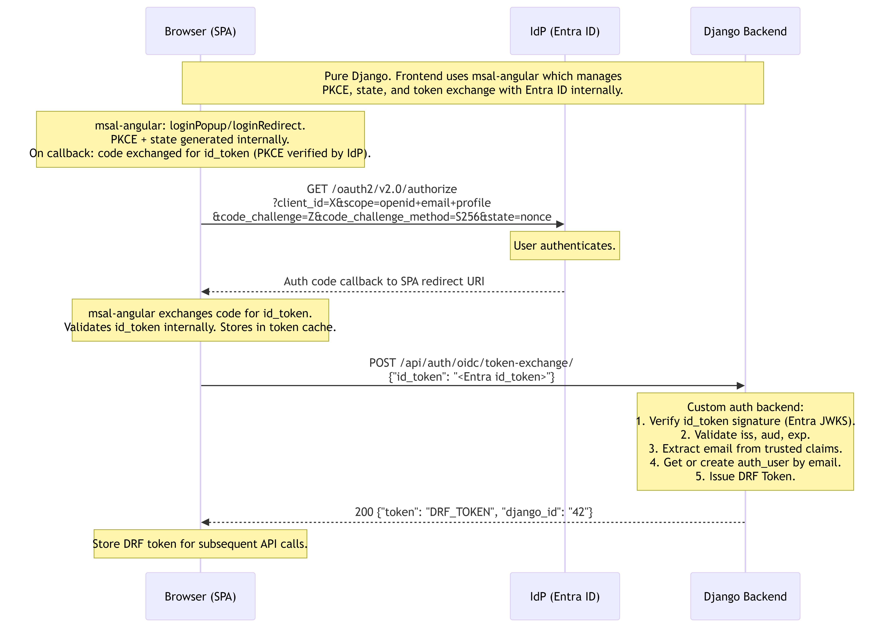

# OIDC Authentication Flow (MSAL-first)

This document covers the OIDC authentication flow across three evolutionary phases:

1. **Pure Django** — MSAL handles Entra OIDC login; the resulting `id_token` is sent to Django, where a custom authentication backend validates it and issues a DRF token. No Cognito involved.
2. **Migration (Cognito + Django)** — MSAL still handles Entra OIDC login; the resulting `id_token` is exchanged into Cognito via a CUSTOM_AUTH challenge. Cognito Lambdas validate the token, call Django for access gating, and issue Cognito JWT tokens. User accounts are linked on first login.
3. **Post-Migration** — same as Migration, but the Cognito user already exists with `custom:django_id` and `custom:auth_provider=oidc_msal` set.

**Key architectural principle**: The frontend library (`msal-angular`) **never changes**. MSAL manages the Entra OIDC login and PKCE in all phases. What changes between phases is only **where the Entra `id_token` goes after MSAL returns it**: Django (phase 1) or Cognito CUSTOM_AUTH (phases 2–3).

---

## Table of Contents

- [Entities](#entities)
- [1. Pure Django Approach](#1-pure-django-approach)
- [2. Migration Process (Cognito + Django)](#2-migration-process-cognito--django)
- [3. Post-Migration](#3-post-migration)
- [4. Comparison and Differences](#4-comparison-and-differences)
  - [4.1 Side-by-Side Comparison](#41-side-by-side-comparison)
  - [4.2 Endpoints Used vs. Not Used](#42-endpoints-used-vs-not-used)
- [5. Security: Token Validation in Lambda](#5-security-token-validation-in-lambda)
- [6. One-Time OIDC Provider Registration](#6-one-time-oidc-provider-registration)

---

## Entities

| Entity | Role |
|---|---|
| **Browser (SPA)** | Frontend single-page application. Uses `msal-angular` to manage all Entra OIDC interactions (PKCE generation, `state`, redirect/popup flow, token cache, silent refresh). The MSAL library is an internal implementation detail of the frontend — it does not appear as a separate system boundary in the flow. |
| **IdP (Entra ID)** | Microsoft Entra ID / Azure AD. Authenticates the user and issues an ID token. |
| **Django Backend** | DRF REST API (`monolith/accounts/`). In phase 1 it is the OIDC token verifier and DRF token issuer. In phases 2–3 it provides internal Lambda APIs for access gating and user mapping but is **not** involved in the browser-facing auth flow. |
| **AWS Cognito** | In phases 2–3: receives Entra `id_token` via CUSTOM_AUTH, verifies it in Lambda, and issues its own JWT tokens (`id_token`, `access_token`, `refresh_token`). Uses no Hosted UI redirects. |
| **VerifyAuthChallengeResponseFunction** | `infrastructure/src/verify_auth_challenge_response.py`. Reads `flow` from `privateChallengeParameters` (set by `CreateAuthChallenge`) as the authoritative routing signal. For `flow=oidc_msal`: validates Entra `id_token` (JWKS, `iss`, `aud`, `exp`), extracts trusted email, calls Django access gate, and ensures the Cognito user exists with `custom:django_id` + `custom:auth_provider=oidc_msal`. |
| **DefineAuthChallengeFunction** | `infrastructure/src/define_auth_challenge.py`. On the first call (empty session) reads `clientMetadata.flow` from `InitiateAuth` to determine the auth flow. On retries reads the flow from `challengeMetadata` (prefixed `"oidc_msal:<step>"`). Issues `CUSTOM_CHALLENGE` or fails the session after max retries. |
| **CreateAuthChallengeFunction** | `infrastructure/src/create_auth_challenge.py`. Determines the flow (same logic as `DefineAuthChallenge`). For `oidc_msal`: sets `challenge_type=oidc_msal` in public parameters, stores `flow=oidc_msal` in **`privateChallengeParameters`** (read by `VerifyAuthChallenge`), and encodes `oidc_msal:OIDC_MSAL` in `challengeMetadata` (read by subsequent `DefineAuthChallenge` calls). |
| **EnsureCognitoUserFunction** | `infrastructure/src/ensure_cognito_user.py`. Non-VPC helper. In the MSAL OIDC path: action `ensure_oidc` creates or updates the Cognito user with `custom:django_id` and `custom:auth_provider=oidc_msal`. No plaintext password from the user is required. |
| **PreTokenGenerationFunction** | `infrastructure/src/pre_token_generation_claims.py`. Runs before every token issuance. Detects `custom:auth_provider=oidc_msal` and maps to `login_method=oidc` for the Django access gate call. Injects `django_id` into the issued token. |

---

## 1. Pure Django Approach

MSAL handles the Entra OIDC flow entirely. After a successful login, the frontend calls a Django token-exchange endpoint with the Entra `id_token`. Django validates the token and issues a DRF Token.

### 1.1 Sequence Diagram



### 1.2 Flow Summary

1. User clicks "Login with Entra" in the SPA.
2. `msal-angular` handles the full Entra OIDC flow internally: generates PKCE pair and `state`, redirects to Entra, handles the callback, exchanges the code for an `id_token`, and stores it in its token cache. The SPA does not interact with raw codes or PKCE values.
3. The SPA calls `POST /api/auth/oidc/token-exchange/` with the Entra `id_token`.
4. Django custom auth backend validates the token (JWKS signature, `iss`, `aud`, `exp`), extracts the trusted email claim, looks up the user, and issues a DRF Token.
5. Frontend stores the DRF token and uses it for all subsequent API calls.

### 1.3 Endpoint Contracts

#### `POST /api/auth/oidc/token-exchange/`

| Field | Type | Required | Description |
|---|---|---|---|
| `id_token` | string | yes | Entra ID token returned by MSAL. |

**Response (200):**
```json
{ "token": "DRF_TOKEN", "django_id": "42" }
```

**Error responses:**
- `401` `{"detail": "JWT signature verification failed."}` — invalid token.
- `401` `{"detail": "JWT has expired."}` — token past `exp`.
- `401` `{"detail": "JWT audience mismatch."}` — token not issued for this app.
- `403` `{"detail": "Access denied."}` — user exists but login method not allowed.
- `404` `{"detail": "User not found."}` — email not registered in Django.

> **Note**: This endpoint is not yet implemented in the codebase. It represents the pure Django phase of the MSAL OIDC flow.

---

## 2. Migration Process (Cognito + Django)

In this phase **Cognito becomes the token issuer**. The frontend still uses MSAL for the Entra login, but after MSAL returns the Entra `id_token`, the SPA initiates a Cognito `CUSTOM_AUTH` flow and hands the token to Cognito for verification and linkage.

**No Hosted UI, no redirect to Cognito's `/oauth2/authorize`.** The CUSTOM_AUTH flow uses direct API calls (`InitiateAuth` + `RespondToAuthChallenge`).

### 2.1 Sequence Diagram


### 2.2 Flow Summary

1. User clicks "Login with Entra".
2. `msal-angular` handles the full Entra OIDC flow (PKCE, redirect, token exchange) and returns an Entra `id_token` to the SPA. On subsequent logins, `acquireTokenSilent()` returns the cached token without a full redirect.
3. SPA calls Cognito `InitiateAuth` with `AuthFlow=CUSTOM_AUTH`, `USERNAME=email`, and **`clientMetadata={flow:"oidc_msal"}`**.
4. Cognito invokes `DefineAuthChallenge`: the session is empty so it reads `clientMetadata.flow=oidc_msal` and routes to `CUSTOM_CHALLENGE`.
5. Cognito invokes `CreateAuthChallenge`: also reads `clientMetadata.flow=oidc_msal` (session is empty), sets `challenge_type=oidc_msal` in public parameters, and — critically — stores `flow=oidc_msal` in **`privateChallengeParameters`** and `oidc_msal:OIDC_MSAL` in `challengeMetadata`. This is the single authoritative flow marker.
6. Cognito returns `CUSTOM_CHALLENGE` with `ChallengeParameters={challenge_type:"oidc_msal", ...}`.
7. SPA calls `RespondToAuthChallenge` with answer `{"id_token":"<Entra JWT>","flow":"oidc_msal"}`.
8. Cognito invokes `VerifyAuthChallengeResponse`:
   - Reads **`privateChallengeParameters.flow=oidc_msal`** (set by `CreateAuthChallenge`) as the authoritative routing signal — not the answer JSON.
   - Validates Entra `id_token` (JWKS signature, `iss`, `aud`, `exp`, `tid`).
   - Extracts email from trusted claims only.
   - Calls `POST /api/internal/login-access-check/` with `login_method=oidc`.
   - Invokes `EnsureCognitoUserFunction` (action=`ensure_oidc`) to create Cognito user with `custom:django_id` and `custom:auth_provider=oidc_msal`.
   - Sets `answerCorrect=True`.
9. Cognito invokes `PreTokenGeneration`:
   - Detects `custom:auth_provider=oidc_msal` → `login_method=oidc`.
   - Calls `POST /api/internal/login-access-check/` → receives `django_id`.
   - Injects `django_id` claim into issued tokens.
10. Cognito returns `{id_token, access_token, refresh_token}` to the SPA.

### 2.3 Endpoint Contracts

#### Cognito `InitiateAuth` (POST — direct SDK/fetch call, no browser redirect)

| Field | Value |
|---|---|
| `AuthFlow` | `CUSTOM_AUTH` |
| `ClientId` | Cognito app client ID |
| `AuthParameters.USERNAME` | User email address |
| `ClientMetadata.flow` | `"oidc_msal"` — tells `DefineAuthChallenge` and `CreateAuthChallenge` which challenge type to issue |

**Response:**
```json
{ "ChallengeName": "CUSTOM_CHALLENGE", "Session": "S1", "ChallengeParameters": { ... } }
```

#### Cognito `RespondToAuthChallenge` (POST — direct SDK/fetch call)

| Field | Value |
|---|---|
| `ChallengeName` | `CUSTOM_CHALLENGE` |
| `ClientId` | Cognito app client ID |
| `Session` | Session token from `InitiateAuth` |
| `ChallengeResponses.USERNAME` | User email address |
| `ChallengeResponses.ANSWER` | `{"id_token":"<Entra JWT>","flow":"oidc_msal"}` |

**Success response:**
```json
{
  "AuthenticationResult": {
    "IdToken": "<Cognito JWT>",
    "AccessToken": "<Cognito JWT>",
    "RefreshToken": "<opaque>",
    "TokenType": "Bearer",
    "ExpiresIn": 3600
  }
}
```

#### `POST /api/internal/login-access-check/` (called by VerifyAuthChallenge + PreToken Lambdas)

| Field | Type | Required | Description |
|---|---|---|---|
| `email` | string | yes | User email extracted from validated Entra token claims. |
| `login_method` | `"oidc"` | yes | Fixed value for MSAL OIDC exchange. |
| `provider_name` | string | no | `EntraOidc` (from `ENTRA_OIDC_PROVIDER_NAME` env var). |

**Response (200):**
```json
{ "allowed": true,  "django_id": "42" }
{ "allowed": false, "reason": "user_not_found", "django_id": null }
```

---

## 3. Post-Migration

The Cognito user already exists with `custom:django_id="42"` and `custom:auth_provider="oidc_msal"` from a previous login. The flow is identical to Migration with one difference: `EnsureCognitoUserFunction` performs an idempotent attribute update instead of creating a new user.

### 3.1 Sequence Diagram


### 3.2 Flow Summary

Steps 1–7 are identical to Migration: `msal-angular` returns an Entra `id_token`, the SPA calls Cognito `InitiateAuth` with `clientMetadata={flow:"oidc_msal"}`, `DefineAuthChallenge` and `CreateAuthChallenge` route to the OIDC_MSAL challenge type, and the SPA sends the token as the challenge answer.

On `VerifyAuthChallengeResponse`:
- Reads `privateChallengeParameters.flow=oidc_msal` (authoritative, set by `CreateAuthChallenge`).
- Token validation and Django access check are identical to migration.
- `EnsureCognitoUserFunction` finds the existing user and calls `admin_update_user_attributes` (no-op if attributes unchanged).

On `PreTokenGeneration`:
- `custom:auth_provider=oidc_msal` is already stored — detection path is identical to migration.
- `django_id` claim injected identically.

### 3.3 Endpoint Contracts

All endpoint contracts are identical to section 2.3. No endpoints are added or removed in the post-migration phase.

---

## 4. Comparison and Differences

### 4.1 Side-by-Side Comparison

| Concern | Pure Django | Migration / Post-Migration |
|---|---|---|
| **Frontend OIDC library** | `msal-angular` (manages PKCE + Entra token exchange) | `msal-angular` (unchanged) |
| **Entra token sent to** | Django `POST /api/auth/oidc/token-exchange/` | Cognito `RespondToAuthChallenge` answer |
| **Token validation** | Django custom auth backend (JWKS, iss, aud, exp) | `VerifyAuthChallengeResponse` Lambda (JWKS, iss, aud, exp, tid) |
| **Token issued to browser** | DRF Token (opaque) | Cognito JWT (`id_token` + `access_token` + `refresh_token`) |
| **Auth flow type** | MSAL → Django REST call | MSAL → Cognito `CUSTOM_AUTH` API call |
| **Browser redirect to Cognito** | None | None (no Hosted UI) |
| **User creation** | Django `get_or_create` in token-exchange view | `EnsureCognitoUserFunction` (action=`ensure_oidc`) |
| **`django_id` in token** | Not applicable | Injected as custom JWT claim by `PreTokenGeneration` |
| **Access gate** | Django token-exchange view (inline check) | `PreTokenGeneration` → `POST /api/internal/login-access-check/` |
| **Marker attribute** | Not applicable | `custom:auth_provider=oidc_msal` stored on Cognito user |

### 4.2 Endpoints Used vs. Not Used

| Endpoint | Pure Django | Migration | Post-Migration |
|---|---|---|---|
| `POST /api/auth/oidc/token-exchange/` | **Used** (by SPA after MSAL) | Not used | Not used |
| `POST /api/internal/login-access-check/` | Not applicable | **Used** (by VerifyAuth + PreToken Lambdas) | **Used** (by VerifyAuth + PreToken Lambdas) |
| `GET /api/internal/user-lookup/` | Not applicable | Not used (django_id from login-access-check) | Not used |
| `POST /api/internal/link-cognito/` | Not applicable | Not used (linking done in EnsureCognitoUser) | Not used |
| Cognito `/oauth2/authorize` | Not used | Not used (no Hosted UI) | Not used |
| Cognito `/oauth2/token` | Not used | Not used (no Hosted UI) | Not used |
| Cognito `InitiateAuth` (CUSTOM_AUTH) | Not used | **Used** (by SPA directly) | **Used** (by SPA directly) |
| Cognito `RespondToAuthChallenge` | Not used | **Used** (by SPA with id_token answer) | **Used** (by SPA with id_token answer) |

---

## 5. Security: Token Validation in Lambda

The `VerifyAuthChallengeResponse` Lambda performs full Entra `id_token` validation before trusting any claim:

| Check | Implementation | Failure action |
|---|---|---|
| **JWT structure** | Must have 3 base64url parts | `answerCorrect=False` |
| **Algorithm** | Must be `RS256` | `answerCorrect=False` |
| **Signature** | RSA-SHA256 verified against Entra JWKS, keyed by `kid` | `answerCorrect=False` |
| **JWKS freshness** | JWKS cached 1 hour per Lambda container; cache invalidated on unknown `kid` | Re-fetched on miss |
| **Expiry (`exp`)** | Must be in the future | `answerCorrect=False` |
| **Issuer (`iss`)** | Must start with `https://login.microsoftonline.com/` | `answerCorrect=False` |
| **Tenant (`tid`)** | If `ENTRA_TENANT_ID` is set, must match exactly | `answerCorrect=False` |
| **Audience (`aud`)** | If `ENTRA_CLIENT_ID` is set, must match exactly | `answerCorrect=False` |
| **Email claim** | Must have `email` or `preferred_username` claim | `answerCorrect=False` |
| **Email source** | Extracted from token claims only — never trusted from client input | N/A |

### Replay protection

Cognito's `CUSTOM_AUTH` session (`Session` token in `RespondToAuthChallenge`) is one-time and short-lived (3 minutes). Once a challenge succeeds or fails, the session cannot be reused. This provides replay protection at the Cognito layer without requiring a Redis nonce store for the OIDC MSAL path.

### Required SAM parameters

```yaml
# samconfig.toml — set before deploying:
EntraTenantId   = "<azure-tenant-id>"          # enforces single-tenant
EntraClientId   = "<entra-app-client-id>"      # audience validation
EntraOidcProviderName = "EntraOidc"            # reported to Django access gate
```

---

## 6. One-Time OIDC Provider Registration

In the MSAL-first Cognito flow, **Cognito does not act as an OIDC Relying Party**. The `OidcIdentityProvider` resource in `infrastructure/template.yaml` (used in the old Hosted UI OIDC flow) is **not required** for the MSAL CUSTOM_AUTH path. The only one-time setup required is:

1. **Entra app registration** — register a SPA application in Entra; add the frontend redirect URI. Note: this is the same app registration MSAL already uses; no separate server-side registration is needed.
2. **SAM parameters** — set `EntraTenantId`, `EntraClientId`, and `EntraOidcProviderName` in `samconfig.toml`.
3. **Cognito user pool schema** — `custom:django_id` and `custom:auth_provider` attributes are declared in the `UserPool` schema in `infrastructure/template.yaml` (already present).

### Entra app registration (one-time)

| Setting in Entra | Value |
|---|---|
| **Application type** | Single-page application (SPA) |
| **Redirect URI** | Frontend SPA URL (used by MSAL) |
| **Client ID** | Displayed in app registration overview — use as `EntraClientId` |
| **Client Secret** | Not required (SPA / public client) |
| **Supported account types** | Single-tenant or multi-tenant, depending on requirements |
| **Access token version** | `"accessTokenAcceptedVersion": 2` in app manifest (required for v2.0 `id_token` format) |

---

*Diagrams rendered with [mermaid-cli](https://github.com/mermaid-js/mermaid-cli) v11. Source files are in `docs/diagrams/oidc-*.mmd`.*
