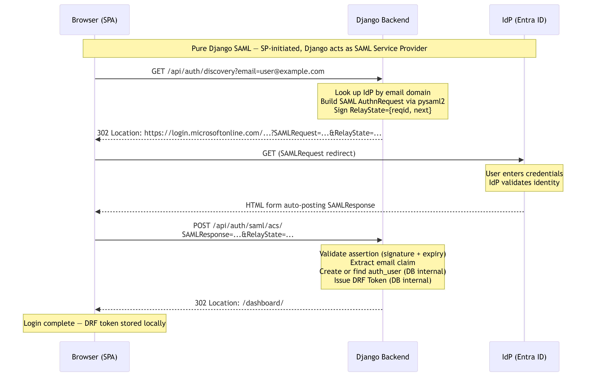
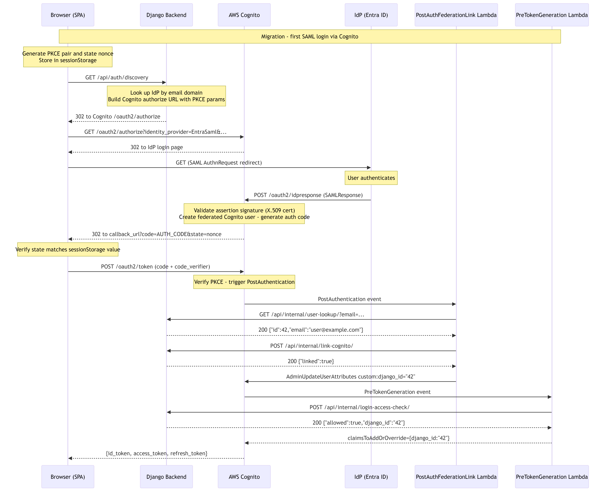

# SAML Authentication Flow

This document covers the SAML authentication flow across three evolutionary phases:

1. **Pure Django** — Django acts as the SAML Service Provider; all SAML logic lives in the monolith.
2. **Migration (Cognito + Django)** — Cognito becomes the SAML SP; Django controls discovery and access gating; user accounts are linked transparently on first login.
3. **Post-Migration** — same as Migration, but the user already has a Cognito profile with `custom:django_id` set; no new mapping is created.

It also explains **PKCE** and the **one-time SAML config synchronisation job** that must be run before the Migration phase begins.

---

## Table of Contents

- [Entities](#entities)
- [1. Pure Django Approach](#1-pure-django-approach)
- [2. Migration Process (Cognito + Django)](#2-migration-process-cognito--django)
- [3. Post-Migration](#3-post-migration)
- [4. Comparison and Differences](#4-comparison-and-differences)
  - [4.1 Side-by-Side Comparison](#41-side-by-side-comparison)
  - [4.2 Endpoints Used vs. Not Used](#42-endpoints-used-vs-not-used)
- [5. PKCE — What It Is and Why It Matters](#5-pkce--what-it-is-and-why-it-matters)
- [6. One-Time SAML Config Synchronisation Job](#6-one-time-saml-config-synchronisation-job)

---

## Entities

| Entity | Role |
|---|---|
| **Browser (SPA)** | Frontend single-page application (`web-login/app.js`). Generates PKCE pairs, stores `state` and `code_verifier` in `sessionStorage`, initiates the redirect chain, and exchanges the authorization code for tokens. |
| **Django Backend** | DRF REST API (`monolith/accounts/`), including the MySQL database. In the pure-Django phase it is the SAML SP. In the Cognito phase it acts as a discovery gateway (email → Cognito provider redirect), provides internal Lambda APIs, and is the authoritative store for users, IdP configs, and migration mappings. |
| **AWS Cognito** | Managed identity provider. In the Cognito phase it becomes the SAML SP, federates with the IdP, and issues JWT tokens. |
| **IdP (Entra ID)** | The external SAML Identity Provider (Microsoft Entra ID / Azure AD). Authenticates the user and issues a SAML assertion. |
| **PostAuthFederationLink Lambda** | `infrastructure/src/post_auth_federation_link.py`. Runs after every federated login. Calls Django internal APIs to look up the user and upsert `user_migration_mapping`, then sets `custom:django_id` on the Cognito profile via Admin API. |
| **PreTokenGeneration Lambda** | `infrastructure/src/pre_token_generation_claims.py`. Runs before every token issuance. Calls Django `POST /api/internal/login-access-check/` (unified gate for all methods). Django returns both the access decision **and** `django_id` in the same response — eliminating any need for a second API call. The Lambda injects `django_id` as a custom JWT claim. |
| **EnsureCognitoUser Lambda** | `infrastructure/src/ensure_cognito_user.py`. Non-VPC helper. Not involved in SAML flows — used only in the password CUSTOM_AUTH flow. |

---

## 1. Pure Django Approach

In this phase Django is the SAML **Service Provider (SP)**. There is no Cognito involvement. The browser communicates directly with Django and the IdP.

**Statement:** discovery by email redirects the browser directly to the IdP. Django encapsulates the IdP lookup and builds the SAML `AuthnRequest` internally.

### 1.1 Sequence Diagram



### 1.2 Flow Summary

1. User enters email on the frontend and clicks "Login with SSO".
2. Frontend navigates the browser to `GET /api/auth/discovery?email=user@example.com`.
3. Django looks up the IdP for the email domain, calls `pysaml2` to build a signed `AuthnRequest`, signs a `RelayState` payload, and returns `302` to the IdP's SSO URL.
4. The browser follows the redirect. The user authenticates on the IdP.
5. The IdP POSTs a `SAMLResponse` back to Django's ACS endpoint `POST /api/auth/saml/acs/`.
6. Django validates the assertion (signature, expiry, audience), extracts the `email` claim, creates or finds the `auth_user`, issues a DRF Token, and redirects the browser to `next#django_token=...&email=...`.
7. The frontend reads the token from the URL fragment and stores it.

### 1.3 Endpoint Contracts

#### `GET /api/auth/discovery`

| Parameter | Location | Description |
|---|---|---|
| `email` | Query string | User's email address. Django resolves the IdP from the email domain internally. |

**Success response:** `302` redirect to IdP SSO URL (pure Django builds the full SAML redirect).

**Error response:** `404` `{"error": "No identity provider configured for this email"}` when no IdP is found.

#### `POST /api/auth/saml/acs/`

| Parameter | Location | Description |
|---|---|---|
| `SAMLResponse` | Form body | Base64-encoded SAML Response from the IdP. |
| `RelayState` | Form body | Signed relay state containing `reqid` and `next` URL. |

**Success response:** `302` redirect to `next#django_token=<token>&email=<email>`

**Error responses:**
- `400` `{"detail": "Missing SAMLResponse"}`
- `400` `{"detail": "Invalid RelayState"}`
- `400` `{"detail": "Email claim not found in SAML response."}`
- `500` `{"detail": "<exception message>"}`

#### `GET /api/auth/saml/metadata/`

No parameters. Returns the SP metadata XML (`Content-Type: application/samlmetadata+xml`). Provided to the IdP administrator to register the SP.

### 1.4 Required IdP Configuration

| Setting | Value |
|---|---|
| SP Entity ID | `SAML_SP_ENTITY_ID` setting (e.g. `https://app.example.com/api/auth/saml/metadata/`) |
| ACS URL | `SAML_ACS_URL` setting (e.g. `https://app.example.com/api/auth/saml/acs/`) |
| Name ID format | Email address (`urn:oasis:names:tc:SAML:1.1:nameid-format:emailAddress`) |
| Attribute mapping | `http://schemas.xmlsoap.org/ws/2005/05/identity/claims/emailaddress` → `email` |

Source files: [`monolith/accounts/saml_views.py`](../monolith/accounts/saml_views.py), [`monolith/accounts/saml_utils.py`](../monolith/accounts/saml_utils.py).

---

## 2. Migration Process (Cognito + Django)

In this phase **Cognito becomes the SAML SP**. Django no longer processes SAML assertions directly. Instead:

- Django handles **IdP discovery** — accepts an email address, looks up the provider internally, and returns a `302` redirect to Cognito's `/oauth2/authorize` endpoint (with PKCE parameters passed through from the browser).
- The frontend constructs the PKCE pair before navigating to the discovery endpoint, ensuring the code challenge is included in the Cognito redirect without any extra round-trip.
- Cognito's `PostAuthFederationLink` Lambda links the federated user to the Django user on first login.
- Cognito's `PreTokenGeneration` Lambda gates access and injects the `django_id` claim before tokens are issued.

**Statement:** discovery by email causes Django to redirect to Cognito with `identity_provider=<provider_name>`, bypassing the Cognito hosted UI entirely.

### 2.1 Sequence Diagram



### 2.2 Flow Summary

1. User enters email and clicks "Login with SAML".
2. Frontend generates a PKCE pair (`code_verifier`, `code_challenge`) and a random `state` nonce. Both `state` and `code_verifier` are stored in `sessionStorage`.
3. Frontend navigates the browser to `GET /api/auth/discovery` with `email`, `state`, `code_challenge`, `code_challenge_method=S256`, `redirect_uri`, and `client_id` as query parameters.
4. Django looks up the IdP for the email domain, builds the full Cognito `/oauth2/authorize` URL (passing through all PKCE params and `state`), and returns `302` to that URL.
   - If no IdP is found: returns `404` with an error message — the browser shows the error page.
5. Cognito looks up the `EntraSaml` provider, builds a SAML `AuthnRequest`, and redirects the browser to the IdP.
6. The user authenticates on the IdP. The IdP posts a `SAMLResponse` to Cognito's ACS endpoint (`/oauth2/idpresponse`).
7. Cognito validates the assertion, extracts the email, creates or links a federated Cognito user, generates an authorization code, and redirects to the frontend callback URL with `?code=AUTH_CODE&state=nonce`.
8. Frontend asserts `state === sessionStorage.federated_auth_nonce` (client-side CSRF check).
9. Frontend exchanges the authorization code for tokens at `POST /oauth2/token` with the stored `code_verifier`.
10. Cognito triggers `PostAuthFederationLink`:
    - Calls `GET /api/internal/user-lookup/` to get the Django user ID by email.
    - Calls `POST /api/internal/link-cognito/` to upsert `user_migration_mapping`.
    - Calls `AdminUpdateUserAttributes` to set `custom:django_id` on the Cognito profile.
11. Cognito triggers `PreTokenGeneration`:
    - Detects `login_method = "saml"` from the `identities` attribute.
    - Calls `POST /api/internal/login-access-check/` to gate access.
    - The response includes `django_id` — no separate call needed, even on first login when `custom:django_id` is not yet on the Cognito profile.
    - Injects `django_id` claim into the ID token.
12. Cognito returns `{id_token, access_token, refresh_token}` to the frontend.

### 2.3 Endpoint Contracts

#### `GET /api/auth/discovery`

| Parameter | Location | Description |
|---|---|---|
| `email` | Query string | User's email. Django resolves the IdP provider internally. |
| `state` | Query string | Random nonce generated by the frontend (used as OAuth2 `state`). |
| `code_challenge` | Query string | `BASE64URL(SHA256(code_verifier))` — PKCE challenge. |
| `code_challenge_method` | Query string | Must be `S256`. |
| `redirect_uri` | Query string | Frontend callback URL (must be registered with Cognito). |
| `client_id` | Query string | Cognito app client ID. |

**Success response:** `302` redirect to Cognito:
```
https://<cognito-domain>/oauth2/authorize
  ?identity_provider=EntraSaml
  &response_type=code
  &client_id=<client_id>
  &redirect_uri=<redirect_uri>
  &scope=openid+email+profile
  &state=<state>
  &code_challenge=<code_challenge>
  &code_challenge_method=S256
```

**Error response:** `404` `{"error": "No identity provider configured for this email"}` when email domain does not match a known IdP.

#### Cognito `/oauth2/authorize` (GET — followed by browser via 302)

Django passes through all parameters from the discovery request. The browser follows the redirect chain automatically.

#### Cognito `/oauth2/token` (POST — browser fetch)

| Field | Value |
|---|---|
| `grant_type` | `authorization_code` |
| `client_id` | Cognito app client ID |
| `code` | Authorization code from callback |
| `redirect_uri` | Must match the one used in `/oauth2/authorize` |
| `code_verifier` | Original random verifier from PKCE pair |

**Response (200):**
```json
{
  "id_token":      "<JWT>",
  "access_token":  "<JWT>",
  "refresh_token": "<opaque>",
  "token_type":    "Bearer",
  "expires_in":    3600
}
```

#### `POST /api/internal/login-access-check/` (called by PreTokenGeneration Lambda)

| Field | Type | Required | Description |
|---|---|---|---|
| `email` | string | yes | User email |
| `login_method` | `"saml"` \| `"oidc"` \| `"password"` | yes | Login method detected from `identities` attribute |
| `provider_name` | string | no | Cognito provider name (federated only) |

**Response (200):**
```json
{ "allowed": true,  "django_id": "42" }
{ "allowed": false, "reason": "user_not_found", "django_id": null }
```

`django_id` is always returned alongside the access decision. `PreTokenGeneration` uses this value directly — no second round-trip to Django is needed, even on the very first SAML login when `custom:django_id` is not yet stored on the Cognito user profile.


---

## 3. Post-Migration

In this phase the user already has a Cognito profile with `custom:django_id` set from a previous SAML login. The flow is identical to the Migration phase with two differences:

1. Cognito matches the existing user — no new Cognito account is created.
2. `PostAuthFederationLink` performs an idempotent upsert (no-op if the mapping already exists).
3. `PreTokenGeneration` receives `django_id` directly from the `login-access-check` response — same as in the migration phase.

### 3.1 Sequence Diagram


### 3.2 Flow Summary

Steps 1–9 are identical to the Migration flow (PKCE generation → discovery redirect → Cognito → IdP → callback → state check → token exchange).

On token exchange:
- `PostAuthFederationLink` runs the same lookup + upsert (idempotent).
- `PreTokenGeneration` calls `login-access-check`, receives `{"allowed":true,"django_id":"42"}`, and injects the claim. The flow is identical to the migration path.

### 3.3 Endpoint Contracts

All endpoints are identical to section 2.3. No additional endpoints are used or removed in the post-migration phase.

---

## 4. Comparison and Differences

### 4.1 Side-by-Side Comparison

| Concern | Pure Django | Migration / Post-Migration |
|---|---|---|
| **SAML Service Provider** | Django (`pysaml2`) | AWS Cognito |
| **IdP configuration stored in** | Django DB / settings | Cognito User Pool Identity Providers |
| **Discovery input** | Email — Django resolves IdP internally | Email — Django resolves IdP internally (same interface) |
| **Discovery output** | `302` directly to IdP SSO URL | `302` to Cognito `/oauth2/authorize` (which redirects to IdP) |
| **ACS endpoint** | `POST /api/auth/saml/acs/` on Django | Cognito `/oauth2/idpresponse` |
| **SAML assertion processing** | Django validates + extracts email | Cognito validates + extracts email |
| **Token issued** | DRF Token (opaque) | Cognito JWT (`id_token` + `access_token` + `refresh_token`) |
| **Token delivery** | URL fragment `#django_token=...` | JSON body from `/oauth2/token` |
| **PKCE** | Not applicable | Yes — browser generates PKCE before navigating to `/api/auth/discovery`; Django passes it through in the Cognito redirect |
| **One-time nonce cookie** | Not used | Not used — `state` in `sessionStorage` + PKCE provides equivalent protection |
| **User creation** | `SamlAcsView` creates user if not found | `PostAuthFederationLink` Lambda links user; Cognito creates federated profile |
| **Access gate** | None | `PreTokenGeneration` → Django `/api/internal/login-access-check/` (returns `allowed` + `django_id`) |
| **`django_id` in token** | Not applicable | Injected as custom claim by `PreTokenGeneration`; value sourced from `login-access-check` response — no separate lookup needed |
| **Direct DB access from Lambda** | N/A | None — all via Django internal APIs |

### 4.2 Endpoints Used vs. Not Used

| Endpoint | Pure Django | Migration | Post-Migration |
|---|---|---|---|
| `GET /api/auth/discovery` | **Used** (→ IdP redirect) | **Used** (→ Cognito redirect) | **Used** (→ Cognito redirect) |
| `POST /api/auth/saml/acs/` | **Used** (by IdP POST) | Not used | Not used |
| `GET /api/auth/saml/metadata/` | **Used** (by IdP admin) | Not used (Cognito handles SP metadata) | Not used |
| `GET /api/internal/user-lookup/` | Not applicable | **Used** (by PostAuth Lambda) | **Used** (by PostAuth Lambda) |
| `POST /api/internal/link-cognito/` | Not applicable | **Used** (by PostAuth Lambda) | **Used** (by PostAuth Lambda — idempotent) |
| `POST /api/internal/login-access-check/` | Not applicable | **Used** (by PreToken Lambda) | **Used** (by PreToken Lambda) |
| `GET /api/internal/resolve-django-id/` | Not applicable | Not used — `django_id` returned by `login-access-check` | Not used |
| Cognito `/oauth2/authorize` | Not used | Followed by browser (via Django 302) | Followed by browser (via Django 302) |
| Cognito `/oauth2/token` | Not used | **Used** (by frontend — fetch) | **Used** (by frontend — fetch) |

---

## 5. PKCE — What It Is and Why It Matters

### What is PKCE?

**Proof Key for Code Exchange (PKCE)** is an extension to the OAuth2 Authorization Code flow (RFC 7636). It prevents **authorization code interception attacks** — scenarios where an attacker intercepts the `?code=...` in the browser's redirect URL and exchanges it for tokens before the legitimate client can.

PKCE is mandatory for all public clients (browser-based SPAs, mobile apps) that cannot securely store a client secret.

### Why no cookie is needed

The `state` parameter (stored in `sessionStorage` and verified client-side on callback) is the standard OAuth2 CSRF protection mechanism defined in RFC 6749 §10.12. Combined with PKCE, the security properties are:

| Threat | Protection |
|---|---|
| Authorization code stolen from URL or network | **PKCE** — attacker cannot exchange the code without `code_verifier` |
| CSRF — attacker forces callback to run in victim's browser | **`state` parameter** — frontend verifies `state === sessionStorage.federated_auth_nonce` |
| Code replay | **PKCE** — `code_verifier` is single-use; Cognito invalidates the code after first use |

This is the same pattern used by major identity SDK implementations (Auth0, Okta, AWS Amplify). A server-side cookie adds auditing but is not required for security.

### How PKCE works in this implementation

```
Browser                                       Django         Cognito
  │                                              │               │
  ├─ 1. Generate code_verifier (random 32B) ───►│               │
  ├─ 2. code_challenge = SHA256(verifier)        │               │
  │      Store verifier + state in sessionStorage│               │
  │                                              │               │
  ├─ 3. GET /api/auth/discovery                  │               │
  │      ?email=...&state=nonce                  │               │
  │      &code_challenge=Z&...              ────►│               │
  │                                              │               │
  │      302 → /oauth2/authorize?...        ◄────│               │
  │             &code_challenge=Z                                 │
  │             &state=nonce                                      │
  │                                                               │
  ├─ 4. GET /oauth2/authorize?identity_provider=X&code_challenge=Z&...
  │                                                               │
  │      (IdP authenticates user)                                 │
  │                                                               │
  ├─ 5. Callback: ?code=AUTH_CODE&state=nonce  ◄─────────────────┤
  │      Assert: state == sessionStorage nonce ✓                  │
  │                                                               │
  ├─ 6. POST /oauth2/token                                        │
  │      code=AUTH_CODE&code_verifier=VERIFIER ──────────────────►│
  │                                                               │  SHA256(VERIFIER) == Z ✓
  │      ← {id_token, access_token, refresh_token} ◄─────────────┤
```

### Implementation in `app.js`

```javascript
function generateCodeVerifier() {
    const array = new Uint8Array(32);
    crypto.getRandomValues(array);
    return btoa(String.fromCharCode(...array))
        .replace(/\+/g, "-").replace(/\//g, "_").replace(/=+$/, "");
}

async function generateCodeChallenge(verifier) {
    const data = new TextEncoder().encode(verifier);
    const digest = await crypto.subtle.digest("SHA-256", data);
    return btoa(String.fromCharCode(...new Uint8Array(digest)))
        .replace(/\+/g, "-").replace(/\//g, "_").replace(/=+$/, "");
}

// Before navigating to discovery:
const codeVerifier  = generateCodeVerifier();
const codeChallenge = await generateCodeChallenge(codeVerifier);
const state         = generateCodeVerifier(); // same random generator

sessionStorage.setItem("federated_auth_nonce",     state);
sessionStorage.setItem("federated_code_verifier",  codeVerifier);

// Navigate to discovery endpoint (browser follows the 302 chain):
window.location.href =
    `/api/auth/discovery?email=${encodeURIComponent(email)}`
    + `&state=${encodeURIComponent(state)}`
    + `&code_challenge=${encodeURIComponent(codeChallenge)}`
    + `&code_challenge_method=S256`
    + `&redirect_uri=${encodeURIComponent(callbackUrl)}`
    + `&client_id=${encodeURIComponent(clientId)}`;
```

### Cognito configuration requirements

| Setting | Required value |
|---|---|
| `AllowedOAuthFlows` | `["code"]` — must NOT include `"implicit"` |
| `AllowedOAuthFlowsUserPoolClient` | `true` |
| `AllowedOAuthScopes` | `["openid", "email", "profile"]` |

### IdP requirements

Some IdPs enforce PKCE independently. Microsoft Entra ID (Azure AD) with v2.0 tokens requires PKCE for cross-origin authorization code redemption. Required Entra app manifest setting:

```json
{ "accessTokenAcceptedVersion": 2 }
```

If Entra returns `AADSTS9002325: Proof Key for Code Exchange is required`, ensure the Cognito OIDC issuer is the v2.0 endpoint: `https://login.microsoftonline.com/{tenant-id}/v2.0`.

---

## 6. One-Time SAML Config Synchronisation Job

Before switching from the Pure Django flow to the Cognito-based flow, all SAML IdP configurations stored in Django must be registered as Cognito Identity Providers. This is done by a **one-time management command** (can also be run periodically to keep configs in sync).

### What it does

1. Reads all active SAML IdP configurations from the Django DB.
2. For each configuration, calls the Cognito API to create or update a `UserPoolIdentityProvider` of type `SAML`.
3. Updates the `UserPoolClient.SupportedIdentityProviders` list to include each new provider.
4. Logs the result of each operation.

### Cognito API calls

#### Create or update an IdP

```python
import boto3

cognito = boto3.client("cognito-idp", region_name="us-east-1")

# Create (first time)
cognito.create_identity_provider(
    UserPoolId="us-east-1_Pb43bECYK",
    ProviderName="EntraSaml",                   # Must match identity_provider= in /oauth2/authorize
    ProviderType="SAML",
    ProviderDetails={
        "MetadataURL": "https://login.microsoftonline.com/.../federationmetadata.xml",
        "IDPSignout":  "true",
    },
    AttributeMapping={
        "email": "http://schemas.xmlsoap.org/ws/2005/05/identity/claims/emailaddress",
    },
)

# Update (if provider already exists)
cognito.update_identity_provider(
    UserPoolId="us-east-1_Pb43bECYK",
    ProviderName="EntraSaml",
    ProviderDetails={
        "MetadataURL": "https://login.microsoftonline.com/.../federationmetadata.xml",
        "IDPSignout":  "true",
    },
    AttributeMapping={
        "email": "http://schemas.xmlsoap.org/ws/2005/05/identity/claims/emailaddress",
    },
)
```

#### Update the app client

```python
client = cognito.describe_user_pool_client(
    UserPoolId="us-east-1_Pb43bECYK",
    ClientId="6flmtjc8bnmd5jtn9aqd5o8ktf",
)["UserPoolClient"]

existing_providers = set(client.get("SupportedIdentityProviders", []))
existing_providers.add("EntraSaml")

cognito.update_user_pool_client(
    UserPoolId="us-east-1_Pb43bECYK",
    ClientId="6flmtjc8bnmd5jtn9aqd5o8ktf",
    SupportedIdentityProviders=list(existing_providers),
)
```

### Django management command skeleton

```python
# monolith/accounts/management/commands/sync_saml_to_cognito.py

import boto3
from botocore.exceptions import ClientError
from django.core.management.base import BaseCommand
from django.conf import settings


class Command(BaseCommand):
    help = "Synchronise SAML IdP configurations from Django DB into Cognito User Pool."

    def add_arguments(self, parser):
        parser.add_argument("--user-pool-id",  required=True)
        parser.add_argument("--client-id",     required=True)
        parser.add_argument("--region",        default="us-east-1")
        parser.add_argument("--dry-run",       action="store_true")

    def handle(self, *args, **options):
        cognito   = boto3.client("cognito-idp", region_name=options["region"])
        pool_id   = options["user_pool_id"]
        client_id = options["client_id"]
        dry_run   = options["dry_run"]

        provider_map = settings.SAML_PROVIDER_MAP  # or query DB model
        created, updated, skipped = 0, 0, 0

        for idp_name, config in provider_map.items():
            provider_name = config["provider_name"]
            metadata_url  = config.get("metadata_url", "")
            if not metadata_url:
                self.stdout.write(f"  SKIP {provider_name}: no metadata_url")
                skipped += 1
                continue

            details = {"MetadataURL": metadata_url, "IDPSignout": "true"}
            mapping = {"email": "http://schemas.xmlsoap.org/ws/2005/05/identity/claims/emailaddress"}

            if dry_run:
                self.stdout.write(f"  DRY-RUN: would upsert {provider_name}")
                continue

            try:
                cognito.create_identity_provider(
                    UserPoolId=pool_id, ProviderName=provider_name,
                    ProviderType="SAML", ProviderDetails=details, AttributeMapping=mapping,
                )
                self.stdout.write(f"  CREATED {provider_name}")
                created += 1
            except ClientError as e:
                if e.response["Error"]["Code"] == "DuplicateProviderException":
                    cognito.update_identity_provider(
                        UserPoolId=pool_id, ProviderName=provider_name,
                        ProviderDetails=details, AttributeMapping=mapping,
                    )
                    self.stdout.write(f"  UPDATED {provider_name}")
                    updated += 1
                else:
                    raise

        if not dry_run and (created + updated) > 0:
            existing = set(
                cognito.describe_user_pool_client(
                    UserPoolId=pool_id, ClientId=client_id
                )["UserPoolClient"].get("SupportedIdentityProviders", [])
            )
            new_providers = {c["provider_name"] for c in provider_map.values()}
            cognito.update_user_pool_client(
                UserPoolId=pool_id, ClientId=client_id,
                SupportedIdentityProviders=list(existing | new_providers),
            )
            self.stdout.write("  Updated SupportedIdentityProviders on app client.")

        self.stdout.write(
            self.style.SUCCESS(f"Done. created={created} updated={updated} skipped={skipped}")
        )
```

**Run:**
```bash
# Dry-run first:
python manage.py sync_saml_to_cognito \
    --user-pool-id us-east-1_Pb43bECYK \
    --client-id 6flmtjc8bnmd5jtn9aqd5o8ktf \
    --dry-run

# Apply:
python manage.py sync_saml_to_cognito \
    --user-pool-id us-east-1_Pb43bECYK \
    --client-id 6flmtjc8bnmd5jtn9aqd5o8ktf \
    --region us-east-1
```

### IdP-side registration (one-time)

When Cognito acts as the SAML SP, the IdP (Entra ID) must be configured to trust it:

| Setting in Entra | Value |
|---|---|
| **Reply URL (ACS)** | `https://<cognito-domain>.auth.<region>.amazoncognito.com/oauth2/idpresponse` |
| **Identifier (Entity ID)** | `urn:amazon:cognito:sp:<user-pool-id>` |
| **Name ID format** | Email address |
| **Attribute claim** | `http://schemas.xmlsoap.org/ws/2005/05/identity/claims/emailaddress` → user's email |

These are registered once in the IdP admin console. The Cognito domain and user pool ID are stable after initial deployment.

---

*Diagrams rendered with [mermaid-cli](https://github.com/mermaid-js/mermaid-cli) v11. Source files are in `docs/diagrams/saml-*.mmd`.*
